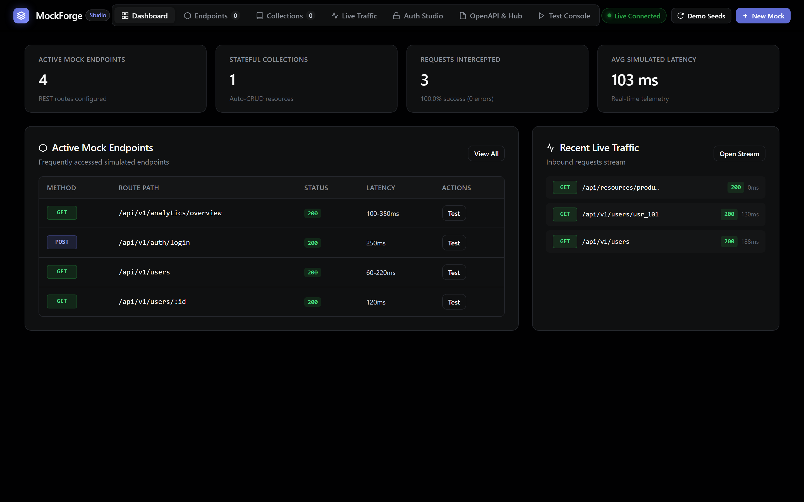
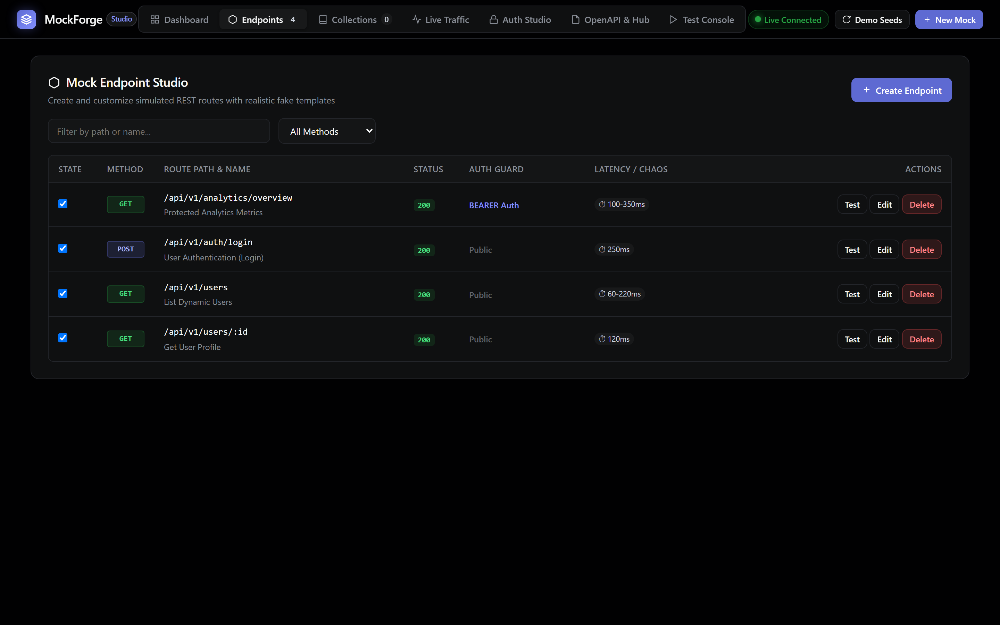
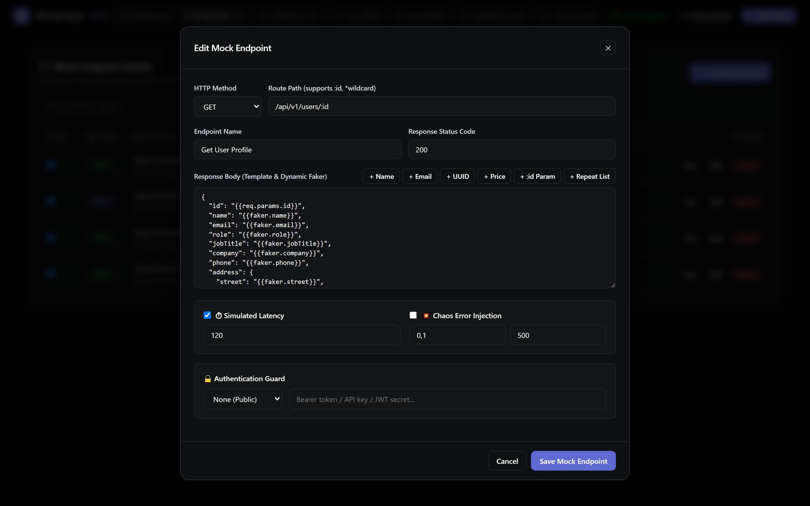
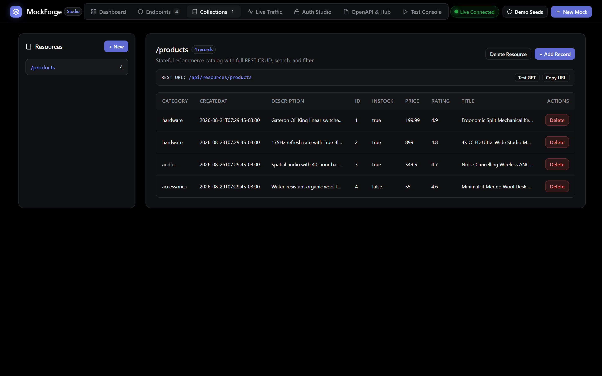
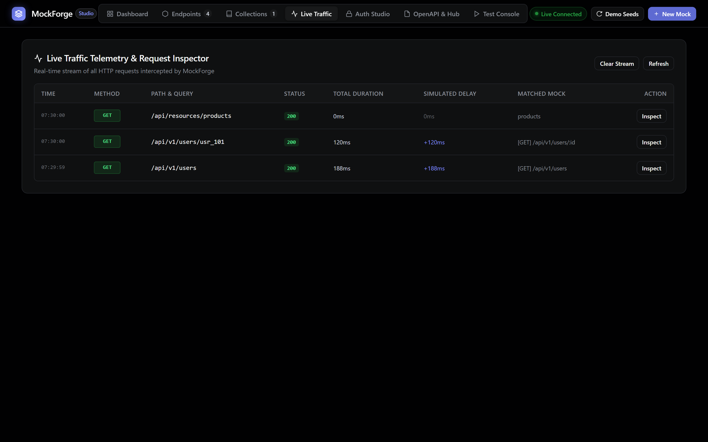
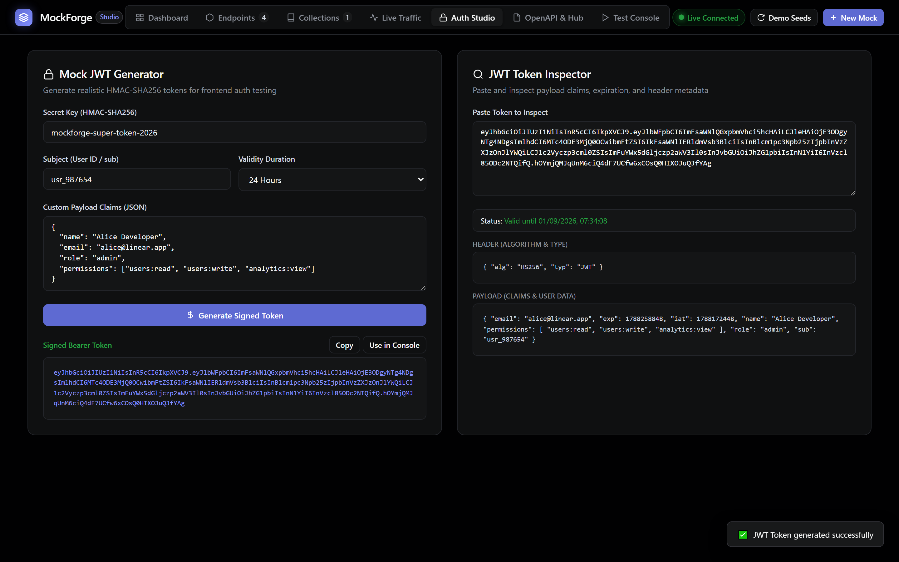
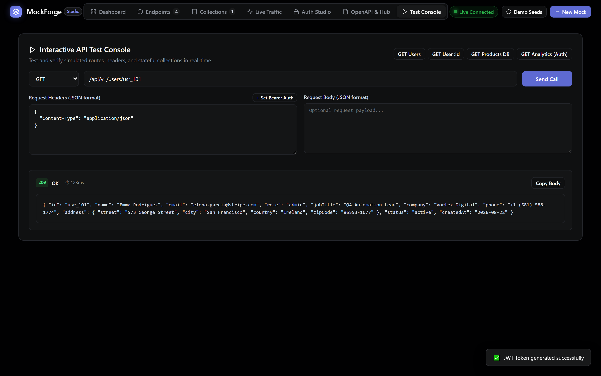

# MockForge Studio ⚡

> **Instant High-Performance API Mock Studio & Frontend Decoupler in Golang**
> Single-binary, ultra-fast mock engine with embedded web interface adhering to the Linear Dark Canvas Design System (`#010102` canvas, `#5e6ad2` Linear lavender accent).

---

## 📸 Real Application Screenshots

### 1. Dashboard & Live Metrics
Visão geral do sistema com contadores de rotas ativas, coleções persistidas, total de requisições interceptadas, latência média calculada e feed em tempo real de tráfego recente.



---

### 2. Endpoint Studio & Visual Route Manager
Gerenciamento completo de rotas REST com badges coloridos por método (`GET`, `POST`, `PUT`, `DELETE`), status codes, guardas de autenticação e controles de latência/caos.



---

### 3. Dynamic Template & Synthetic Faker Editor
Editor visual de respostas com gerador de dados dinâmicos (`{{faker.name}}`, `{{faker.email}}`, `{{faker.uuid}}`, `{{#repeat N}}...{{/repeat}}`), sliders de delay/jitter e injeção probabilística de erros de caos.



---

### 4. Stateful Auto-CRUD Collections (Resource DB)
Banco de dados em memória persistível que gera automaticamente todos os verbos REST (`GET`, `POST`, `PUT`, `PATCH`, `DELETE`) para entidades dinâmicas com suporte a busca (`?q=`), filtros, ordenação e paginação.



---

### 5. Real-Time Request Inspector & SSE Stream
Stream de requisições ao vivo via Server-Sent Events (SSE) com drawer de inspeção detalhada de cabeçalhos de entrada, payload JSON de resposta, medição de latência e gerador de comandos cURL.



---

### 6. Auth Studio & Mock JWT Generator
Emissor e validador de tokens JWT (HMAC-SHA256) com claims customizados (`role=admin`, `email`, permissões), além de suporte para Bearer Tokens, API Keys e Basic Auth.



---

### 7. Interactive In-Browser API Test Console
Console interativo estilo Postman integrado diretamente na aplicação para disparar requisições HTTP em tempo real, testar autenticação e inspecionar retornos instantaneamente.



---

## 🌟 Key Features

1. **Instant Mock Endpoint Studio**:
   - Criação dinâmica de rotas REST (`GET`, `POST`, `PUT`, `PATCH`, `DELETE`, `OPTIONS`, `HEAD`).
   - Matcher com suporte a parâmetros (`/api/v1/users/:id`, `/orders/{orderId}/items/:itemId`) e wildcards (`/assets/*path`).
   - Status codes configuráveis (200, 201, 204, 400, 401, 403, 404, 422, 500) e cabeçalhos customizados.

2. **Dynamic Template & Synthetic Faker Engine**:
   - Interpolação de dados sintéticos realistas:
     - `{{faker.name}}`, `{{faker.email}}`, `{{faker.uuid}}`, `{{faker.avatar}}`
     - `{{faker.company}}`, `{{faker.jobTitle}}`, `{{faker.phone}}`
     - `{{faker.street}}`, `{{faker.city}}`, `{{faker.country}}`, `{{faker.zipCode}}`
     - `{{faker.price(min, max)}}`, `{{faker.number(min, max)}}`, `{{faker.boolean}}`
     - `{{faker.date}}`, `{{faker.datetime}}`, `{{faker.pastDate(30)}}`, `{{faker.futureDate(30)}}`
     - `{{faker.lorem(10)}}`, `{{faker.sentence}}`, `{{faker.paragraph}}`
   - Parâmetros e contexto da requisição:
     - `{{req.params.id}}`, `{{req.query.search}}`, `{{req.headers.authorization}}`, `{{req.body.name}}`, `{{req.method}}`, `{{req.path}}`, `{{req.clientIp}}`
   - Loops dinâmicos de repetição:
     - `{{#repeat 5}} { "id": {{@iteration}}, "name": "{{faker.name}}" } {{/repeat}}`

3. **Stateful Auto-CRUD Resource Collections**:
   - Banco de dados em memória persistível com endpoints REST automáticos para frontend:
     - `GET /api/resources/:collection` (com busca `?q=termo`, filtro `?status=active&price_gte=100`, ordenação `?_sort=price&_order=desc` e paginação `?_page=1&_limit=10`)
     - `GET /api/resources/:collection/:id`
     - `POST /api/resources/:collection` (gera IDs sequenciais/UUIDs e timestamps `createdAt`/`updatedAt`)
     - `PUT /api/resources/:collection/:id` (atualização completa)
     - `PATCH /api/resources/:collection/:id` (merge parcial)
     - `DELETE /api/resources/:collection/:id`

4. **Network Latency & Chaos Resilience Simulator**:
   - **Latência Fixa**: Simulação de delay determinístico (ex: 200ms).
   - **Jitter Aleatório**: Faixa de latência min/max (ex: 50ms a 350ms).
   - **Injeção de Caos**: Taxa de falha probabilística (ex: 10% de chances de erro HTTP 500/503/429) para testar fallbacks no frontend.

5. **Authentication & Security Guard Simulator**:
   - No Auth (Public).
   - Bearer Token verification.
   - API Key verification (via header `X-API-Key` ou query parameter `?api_key=...`).
   - HTTP Basic Auth (`username:password`).
   - Mock JWT issuer & claim validator (HMAC-SHA256 signature verification, expiration check, required role/claim enforcement).

6. **Real-time Live Traffic Stream**:
   - Buffer circular em tempo real com stream via **Server-Sent Events (SSE)**.
   - Request inspector com headers, payload JSON, duração, delay simulado, gerador de cURL e replay no console de testes.

7. **OpenAPI 3.0 & Workspace Hub**:
   - Importação de OpenAPI 3.0 specs (auto-gera mock endpoints com schemas sintetizados).
   - Exportação de mock endpoints como OpenAPI 3.0 JSON.
   - Backup e restauração completa de workspaces.

8. **Embedded Linear Dark Canvas Web UI**:
   - Single-Page Application embarcada diretamente no executável Go (`embed.FS`).
   - Estilizada estritamente conforme o `DESIGN.md` (`#010102` dark canvas, `#5e6ad2` Linear lavender, bordas hairline).

---

## 🚀 Como Executar

### 1. Iniciar com Go
```bash
go run .
```

### 2. Porta Customizada e Persistência
```bash
go run . -port 8080 -store mockforge_data.json
```

### 3. Acessar o Web Studio
Abra no seu navegador: **[http://localhost:8080](http://localhost:8080)**.

---

## 🧪 Testes e Verificação

```bash
# Executar suíte de testes unitários e de integração
go test -v ./...

# Análise estática do Go
go vet ./...

# Sensor de Spec Drift (SDD)
node .agents/scripts/check-spec-drift.js

# Compilar binário standalone de produção
go build -o mockforge.exe .
```

---

## 📁 Estrutura de Arquivos

```
.
├── main.go                       # Entrypoint CLI & assets embutidos (embed.FS)
├── pkg/
│   ├── models/                   # Modelos de dados e contratos de domínio
│   ├── template/                 # Engine de interpolação e gerador Faker sintético
│   ├── auth/                     # Guardas de autenticação e emissor/validador JWT
│   ├── store/                    # Banco de dados stateful Auto-CRUD
│   ├── traffic/                  # Buffer circular e broadcast SSE em tempo real
│   ├── openapi/                  # Parser e exportador OpenAPI 3.0 / Workspace
│   ├── engine/                   # Servidor central de mock, roteador e simulação de caos
│   └── web/                      # Servidor de arquivos estáticos embarcados e fallback SPA
├── web/                          # Assets da interface web SPA (Linear Design System)
│   ├── index.html
│   ├── css/style.css
│   └── js/
│       ├── app.js
│       ├── api.js
│       └── views/
└── docs/images/                  # Screenshots reais da aplicação capturados via Playwright
```
