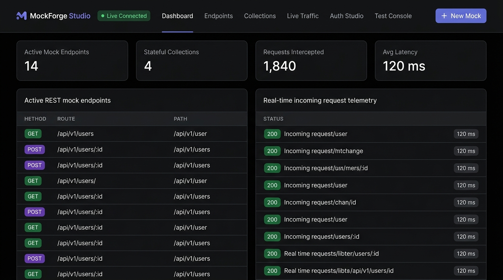
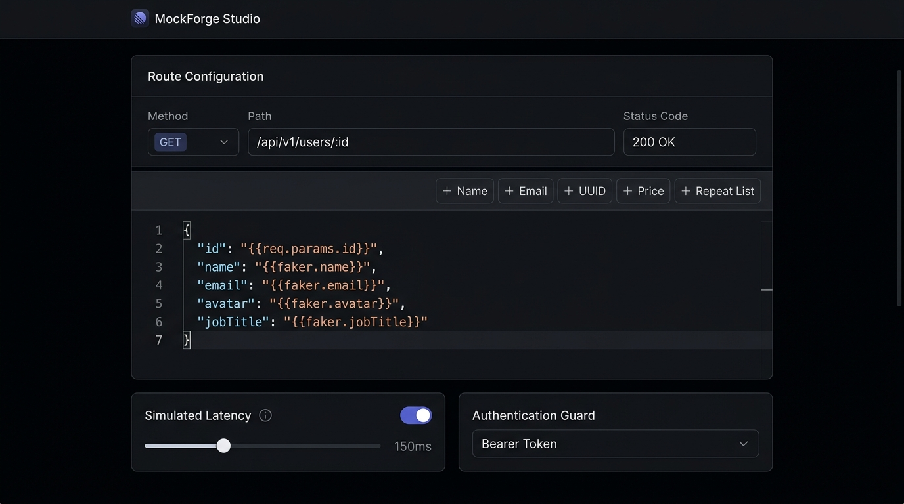
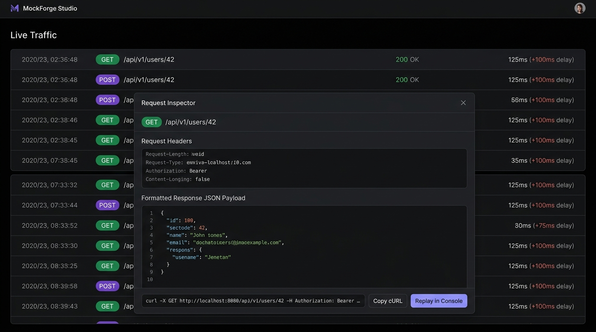

# MockForge Studio ⚡

> **Instant High-Performance API Mock Studio & Frontend Decoupler in Golang**
> Single-binary, ultra-fast mock engine with embedded web interface adhering to the Linear Dark Canvas Design System (`#010102` canvas, `#5e6ad2` Linear lavender accent).

---

## 📸 Interface Preview

### 1. Dashboard & Telemetry Overview


### 2. Visual Endpoint Studio & Dynamic Faker Templates


### 3. Real-Time Request Inspector & Live Stream


---

## 🌟 Key Features

1. **Instant Mock Endpoint Studio**:
   - Create dynamic REST endpoints (`GET`, `POST`, `PUT`, `PATCH`, `DELETE`, `OPTIONS`, `HEAD`).
   - Parameterized path matching (`/api/v1/users/:id`, `/orders/{orderId}/items/:itemId`) and wildcards (`/assets/*path`).
   - Configurable status codes (200, 201, 204, 400, 401, 403, 404, 422, 500) and custom response headers.

2. **Dynamic Template & Synthetic Faker Engine**:
   - Realistic synthetic data interpolation:
     - `{{faker.name}}`, `{{faker.email}}`, `{{faker.uuid}}`, `{{faker.avatar}}`
     - `{{faker.company}}`, `{{faker.jobTitle}}`, `{{faker.phone}}`
     - `{{faker.street}}`, `{{faker.city}}`, `{{faker.country}}`, `{{faker.zipCode}}`
     - `{{faker.price(min, max)}}`, `{{faker.number(min, max)}}`, `{{faker.boolean}}`
     - `{{faker.date}}`, `{{faker.datetime}}`, `{{faker.pastDate(30)}}`, `{{faker.futureDate(30)}}`
     - `{{faker.lorem(10)}}`, `{{faker.sentence}}`, `{{faker.paragraph}}`
   - Request parameter and context echo:
     - `{{req.params.id}}`, `{{req.query.search}}`, `{{req.headers.authorization}}`, `{{req.body.name}}`, `{{req.method}}`, `{{req.path}}`, `{{req.clientIp}}`
   - Dynamic array repeat loops:
     - `{{#repeat 5}} { "id": {{@iteration}}, "name": "{{faker.name}}" } {{/repeat}}`

3. **Stateful Auto-CRUD Resource Collections**:
   - In-memory & persisted resource store providing automatic full REST CRUD:
     - `GET /api/resources/:collection` (with search `?q=term`, filter `?status=active&price_gte=100`, sort `?_sort=price&_order=desc`, and pagination `?_page=1&_limit=10`)
     - `GET /api/resources/:collection/:id`
     - `POST /api/resources/:collection` (auto-generates `id`, `createdAt`, `updatedAt`)
     - `PUT /api/resources/:collection/:id` (full update)
     - `PATCH /api/resources/:collection/:id` (partial merge)
     - `DELETE /api/resources/:collection/:id`

4. **Network Latency & Chaos Resilience Simulator**:
   - **Fixed Delay**: Simulate real-world round-trip times (e.g. 250ms).
   - **Random Jitter**: Configure min-max latency ranges (e.g. 50ms - 400ms).
   - **Chaos Error Injection**: Probabilistic failure rate (e.g. 10% chance of HTTP 500/503/429) to test frontend error boundaries and retry logic.

5. **Authentication & Security Guard Simulator**:
   - No Auth (Public).
   - Bearer Token verification.
   - API Key verification (via header `X-API-Key` or query parameter `?api_key=...`).
   - HTTP Basic Auth (`username:password`).
   - Mock JWT issuer & claim validator (HMAC-SHA256 signature verification, expiration check, required role/claim enforcement).

6. **Real-time Live Traffic Stream**:
   - Circular buffer recording inbound requests.
   - Server-Sent Events (SSE) live push to the browser UI.
   - Request inspector with headers, body, response status, duration, cURL generator, and test console replay.

7. **OpenAPI 3.0 & Workspace Hub**:
   - Import OpenAPI 3.0 specs (auto-generates mock endpoints with synthesized schemas).
   - Export mock endpoints as OpenAPI 3.0 JSON.
   - Full workspace export and restore.

8. **Embedded Linear Dark Canvas Web UI**:
   - Zero-dependency Single-Page Application embedded directly inside the Go binary (`embed.FS`).
   - Styled strictly adhering to `DESIGN.md` (`#010102` dark canvas, `#5e6ad2` Linear lavender accent, hairline borders).

---

## 🚀 Quick Start

### 1. Run with Go
```bash
go run .
```

### 2. Custom Port & Options
```bash
go run . -port 8080 -store mockforge_data.json
```

### 3. Open the Web Studio
Open your browser at **[http://localhost:8080](http://localhost:8080)**.

---

## 🧪 Running Tests & Sensors

```bash
# Run unit & integration test suite
go test -v ./...

# Verify Go static analysis
go vet ./...

# Verify Spec Drift Sensor
node .agents/scripts/check-spec-drift.js

# Build standalone production executable
go build -o mockforge.exe .
```

---

## 📁 Architecture Overview

```
.
├── main.go                       # CLI Entrypoint & embedded assets
├── pkg/
│   ├── models/                   # Domain data structures
│   ├── template/                 # Template parser & synthetic faker generator
│   ├── auth/                     # Auth guard & JWT validator/issuer
│   ├── store/                    # Stateful collection auto-CRUD database
│   ├── traffic/                  # Circular buffer & SSE broadcaster
│   ├── openapi/                  # OpenAPI 3.0 & workspace serializer
│   ├── engine/                   # Mock HTTP dispatcher, router & chaos engine
│   └── web/                      # Embedded web server & static asset handler
└── web/                          # Frontend SPA assets (DESIGN.md compliant)
    ├── index.html
    ├── css/style.css
    └── js/
        ├── app.js
        ├── api.js
        └── views/
```
